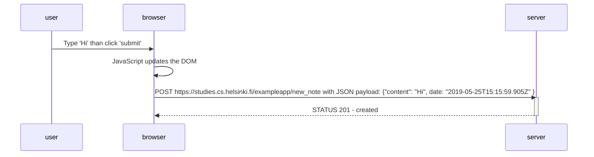

```mermaid

sequenceDiagram
    participant user
    participant browser
    participant server

    user->>browser: Type 'Hi' than click 'submit'
    browser->>browser: JavaScript updates the DOM
    browser->>server: POST https://studies.cs.helsinki.fi/exampleapp/new_note with JSON payload: {"content": "Hi", date: "2019-05-25T15:15:59.905Z" }
    activate server
    server-->>browser: STATUS 201 - created
    deactivate server
``` 